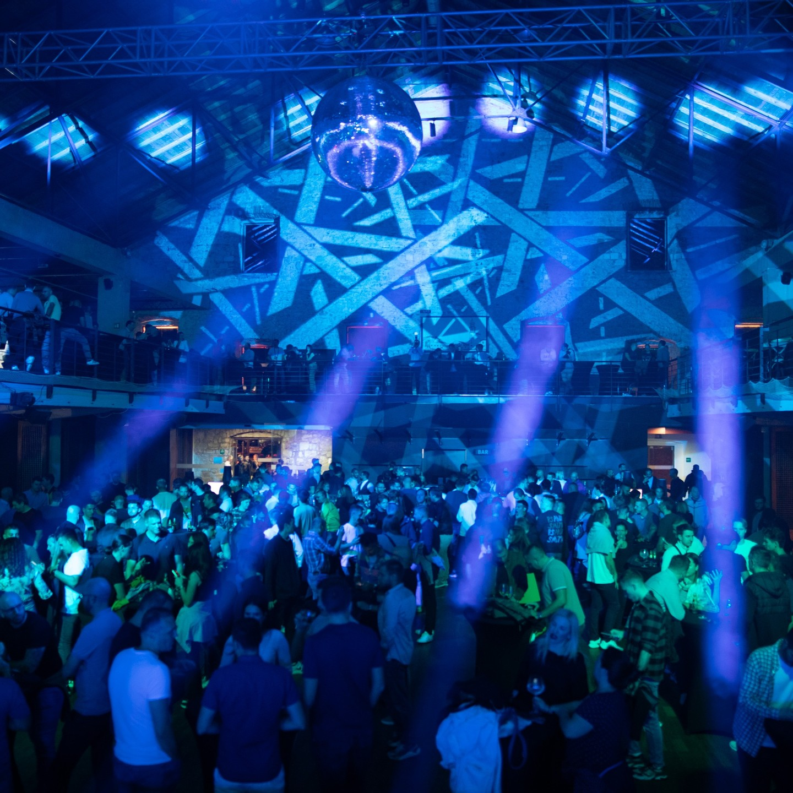

Picture this: you're excited, you've booked your tickets, and you're ready for a
**couple of days of intellectual stimulation** at what you think is a **tech
conference**. Except, it's not exactly what you'd imagined. Allow me to break
it down, with my usual dose of honesty because, really, you deserve the truth.

## A Slightly Deflated Balloon

**Infobip Shift, Zadar, Croatia, September 15-17, 2024**, we went there with Aziz,
fellow developer at BearStudio. The website promises an event for **4,000 people**.
Reality check: I counted 1,000 chairs, max. Sure, the venue could theoretically
hold 6,500 people, but half the space was just... air. They probably thought we
wouldn’t notice the missing crowd, but come on, I’m not blind. **Typical inflated
numbers** that tech events love to throw around, **sponsored by big companies** to
puff up their feathers. Speaking of which…

_Photo credit: https://www.instagram.com/infobip.shift_
_Where are the 4000 people?_

## High Hopes and Reality Checks

Tejas Kumar’s session, “**AI Engineering Today and Tomorrow**,” was like the one
bright spot in an otherwise cloudy conference. Aziz had seen Tejas at React
Paris 2023, and he delivered again with that same **mix of clarity and actionable
insight**. He laid out how **any dev could pivot to AI engineering** with minimal
coding—yep, even you who still battles CSS grids. And then he casually dropped
a gem: **Langflow**. This tool makes working with GPT-3.5 simple, and affordable,
and lets you play with real-time data without losing your sanity (or touching a
line of code). For a moment, it felt like the conference might actually live up
to its promise. What I understood from the talk is that by being able to use an
API, I’m officially an AI engineer too!

## When the Promising Turns to Pitching

Fueled by Tejas’s talk, I strolled into the round table on “**The Impact of AI on
Junior Developers.**” Tejas was joined by someone from Microsoft, and **I thought we
were in for a genuine discussion**. Wrong. Simi turned it into an **extended
commercial for Microsoft tools**, complete with a hint of desperation—because
let's be honest, Copilot has been losing ground to Cursor AI. What should have
been a session full of practical advice for nurturing new talent in the age of
AI became another generic product pitch. The room was buzzing, but not in a good
way; the disappointment was almost palpable.

## The Thin Line Between Insightful and Insulting

Outside of a few exceptions, most of the conference **felt technically shallow**,
like skimming through a YouTube tutorial with the sound off. One talk that could
have broken the trend was “**Standardized Dev Environments: Improving
Productivity.**” It started on point—talking about the pain of **setting up
environments that make onboarding feel like a bad escape room**. But just when we
were getting somewhere, **the demo wasn’t working**, he just couldn’t show us the
amazing work they had been achieving. The talk was given by the CTO of the
company and in just a second, its credibility dropped to 0. In a devops talk, no
less. If there’s one lesson here, it’s this: **always have a video backup**, folks.
It was frustratingly basic, but somehow not surprising.

Amid this sea of sponsored fluff, there was a **beacon of authenticity**:
**Anton Kazakov’s talk on “Healthy Performance & Career Management for
Engineers.**” As an engineering director at Canonical, Anton didn’t waste
time with buzzwords. Instead, he **shared a decade's worth of experience**,
offering a framework that’s both **fair and growth-oriented.** His session felt
like one of those rare moments where you don’t just nod along—you actually write
down notes.

We also attended the talk of **[Elian Van Cutsem](/people#elian-van-cutsem) about Astro Studio**. He usually
organizes React conferences. The presentation covered **Astro**, a web framework
designed for **content-driven websites**, and introduced its **new database
platform, Astro Studio**. Elian explained how Astro differentiated itself
through its unique approach to JavaScript: by default, it **compiled everything**
to pure HTML and CSS, **shipping zero JavaScript** to the client. This wasn't
just a performance optimization—it was a fundamental design choice that let
developers explicitly **opt into interactivity only where needed**.
_You can find the talk on [youtube](https://www.youtube.com/watch?v=SszN-3s8RvI)._

But these were the 2 exceptions.
Too many other talks felt more like sales pitches wrapped in keynote slides.

This trend is exactly why we’re launching **[Fork it! Community](/about)**, to cut
through the noise and bring real tech value to the table. Whether through
**[conferences](/events)**, **[meetups](/events)**, or **workshops**, our aim is simple: **keep it
real, share true experiences**, and leave the marketing gloss at the door.
Developers deserve spaces where they can **learn, challenge, and grow**—not
just be sold to.

### It’s Not a Conference, It’s a Sales Pitch

Turns out, Infobip, the host of this "conference," isn’t just some event
organizer. Nope. They're a colossal company with 50,000 employees. That’s right,
**50,000**. And surprise, surprise, the whole event feels like a **cleverly
disguised marketing campaign** for Infobip.

I mean, the keynote was basically a long infomercial. Imagine **paying 300-400
euros to be part of an audience for a company’s product launch**. Yeah, we paid
to get pitched to. After day one, Aziz and I started heading to the venue just
to grab coffee. Honestly, we were tempted to stay at the hotel and do some
actual work—because at least that would’ve felt productive.

### The After-Party That Wasn’t

We were promised an after-party, and I had my hopes up. I mean, it’s Croatia\!
I envisioned networking over drinks, maybe some casual business chat. Instead,
we ended up in a nightclub, not the best place to have meaningful conversations.
Honestly, Aziz and I bounced out pretty quickly.

_Photo credit: https://www.instagram.com/infobip.shift_
_Seriously, who wants to be there for networking?_

### “Day Two” or “Why Bother?”

Day two was, in a word, pointless. The talks were almost exclusively
sponsor-driven, and we figured we’d gain more by working than by sitting through
hours of promotional fluff. So we skipped out, back to the hotel for some real
work. I mean, why waste the day, right?

### So, Is It Worth It?

Is InfoBip Shift worth your time and money? Well, if you're looking for a
laid-back **team-building experience** in a charming city, Zadar’s not a bad
choice. The food trucks were decent, and there was even a free barber—which
might sound off topic, but it was really cool to be able to enjoy some **side
activities besides the tech talks**. And the serious tech talks? Eh, not so
interesting and sounding too much like ads.

If you’re after genuine insights, prepare to filter through a lot of **corporate
sales pitches**. If you enjoy big-company promos and can tolerate some mediocre
sessions, go for it. Otherwise, save your euros, find a **more niche,
developer-focused event,** and make sure to avoid any conf that feels more like
an advertisement than an actual knowledge-sharing platform.

As for me? I’ll think twice before grabbing tickets to the next corporate tech
“event.” You’ve been warned.
