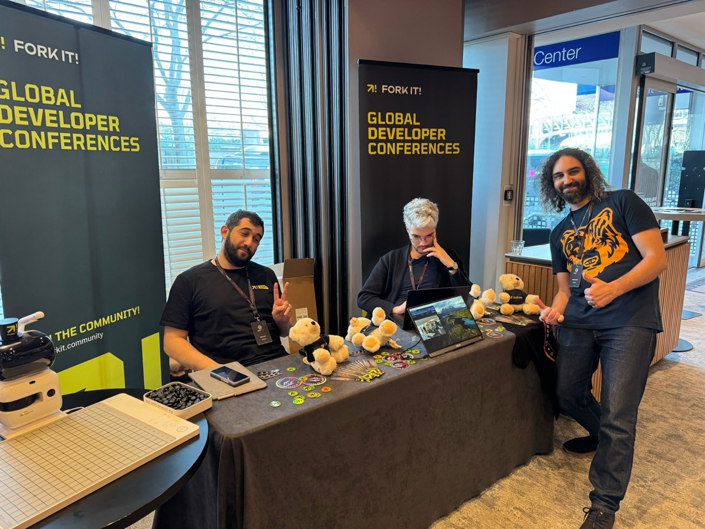

Alright, we’re finally kicking off the blog section of Fork it 🎉
And what better way to start than with a quick experience report from React
Paris 2025, an event several of us took part in a few weeks ago.

---

## What’s Fork it again?

If you haven’t heard of us yet, **Fork it** is a tech community focused on
**experience sharing** — no bullshit, no hype.

We organize meetups all over the world, connect people, and highlight local
initiatives. One of our main goals is to be an entry point into the broader tech ecosystem.

That’s why we wanted to share some feedback from React Paris — a conference
we’re not 100% objective about, to be honest. We’re friends with the team, we
helped co-organize a meetup the night before, and we even sponsored the event.
(But hey, we still paid for our booth and tickets — so we’re totally allowed to
say whatever we want 😅)

---

## The Pre-Conference Meetup

The night before the conference, Fork it hosted a relaxed and fun meetup with
about 30 attendees — including some big names from the React ecosystem.
The first speaker even told us he got a little nervous seeing who was in the
front row: **Kent C. Dodds**, **Dominik Dorfmeister** (Tkdodo), **François Best**, and
others 👀

<blockquote className="mb-0">
Personally, as someone who’s not from the JS world, I didn’t recognize anyone… and almost gave them a hard time for not being on the guest list 😂
</blockquote>

—Rudy

We had three great talks on a variety of topics:
  - <a href="/events/2025-france-paris-meetup/talks/building-and-deploying-a-model-in-the-browser-to-do-gesture-recognition">**"Building and deploying a model in the browser to do gesture recognition"**</a> - *Gabriel Pichot*
  - <a href="/events/2025-france-paris-meetup/talks/local-first-has-a-branding-problem">**"Local-first Has a Branding Problem"**</a> - *David Gomes*
  - <a href="/events/2025-france-paris-meetup/talks/the-tests-that-write-themselves-almost">**"The Tests That Write Themselves (Almost)"**</a> - *Nicolas Dubien*

Huge thanks to **Hymaïa** for hosting us, and to **Neon** & **Pigment** for
supporting the event. Great talks, relaxed vibes, spontaneous chats — exactly
the kind of community moment we love.

---

## The React Paris Conference Talks

OK, enough about the pre-conference meetup, you are probably reading this blog
post to learn more about React Paris, and here we go with a non-exhaustive list
of talks. This part has been written by Ivan and Yoann:

Day one started right: a solid breakfast and an insightful talk from
**Kent C. Dodds**. In the React world, Kent C. Dodds is a name everyone knows,
especially thanks to his Epic React course and more recently his Epic Stack
project. Kent is a natural educator, and even though the talk didn’t dive into
advanced React, it was still engaging. It served as a solid reminder of the
relationship between the client, the server, and the network in between, making
us rethink how we approach performance—with and without JavaScript. We were
secretly hoping for a jQuery throwback to relive our wildest coding years,
but not a single `$` made an appearance 😛.

This event delivered solid, practical talks with real takeaways. Some of the
standout topics:

- **Demystifying Accessibility in React Apps** by *Kateryna Porshnieva* – Accessibility
  talks often feel repetitive, but this one stood out. While it was clearly aimed
  at beginners, the way Kateryna approached and explained key concepts felt fresh
  and well thought-out. A great intro for those just getting into accessibility.
- **Goodbye, useState** by *David Khourshid* – David has made state management
  his specialty, and this talk really reflected that. It’s the kind of talk I
  recommend early to React beginners because it addresses exactly the mistakes I
  often see during audits. Definitely a must-watch, rewatch, and share—for the
  greater good of React developers everywhere.
- **Type-Safe URL State Management in React with nuqs** by [*François Best*](/people/francois-best) – How
  can we talk about this without sounding like fanboys? We’ve known François for
  a while now—it started with sponsoring [nuqs](https://nuqs.47ng.com/), then we met at React Paris 2024,
  and we told him: “You should give a talk at our event in Rouen this June, 
  it’ll be fun.” That’s how he gave his first [Fork it! talk about maintaining an Open Source library for Next.js](https://www.forkit.community/events/2024-france-rouen/talks/maintaining-an-open-source-library-for-next-js-feedback-and-tips). Naturally, we loved
  it—because it’s genuinely useful. We’re tired of web apps that don’t store
  interface state in the URL. It’s so frustrating to set filters, refresh the
  webpage, and lose everything. Dear developers: please [go watch the recording
  of this talk!](https://www.youtube.com/watch?v=U__Rwsp8v78)
- **React Query API Design – Lessons Learned** by *Dominik Dorfmeister* – Do
  React developers still need an introduction to Dominik Dorfmeister, aka TkDodo?
  He was one of the leading educators on TanStack Query (formerly React Query)
  for years thanks to his blog, and is now one of the core contributors. His talk
  was a valuable reflection on open source community dynamics and how API design
  evolves in tools we use every day. A solid and insightful talk that’s worth\
  checking out. The main takeaway of this talk is “**Please use the beta version of libraries!**”

<small>[Find all the VOD on YouTube](https://www.youtube.com/playlist?list=PL53Z0yyYnpWitP8Zv01TSEQmKLvuRh_Dj)</small>

---

## The Booth & Conversations

We spent two full days at our booth, talking to people from across Europe
(and beyond). We had dozens of great convos, and left with a bunch of contacts:
potential speakers, future interviewees, and community organizers we hope to
collaborate with soon.

So yeah — expect a lot more content and events in the coming months!

## Final Thoughts

As we said at the beginning — we're not completely objective, but at least we're honest about it.

**Is it worth attending for a frontend dev?** Absolutely

**Even if you’re not into React?** Ivan and Yoann would tend to say yes. React is in the name of the conference, but it is really accessible to frontend developers and even more.

**Vibe, venue, people?** All really solid.

**As a sponsor, was it worth it?** That’s always hard to measure precisely — but for Fork it! Community, it was a yes. We were able to build meaningful connections with folks from the JS world, and those bridges will help us connect communities even better.

## What’s next?

- React Paris 2026 has already been announced
- React Brussels is in the pipeline (to be confirmed)
- And a few other React-focused conferences are being cooked up 👀

