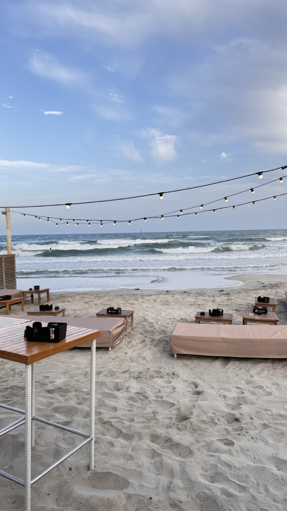
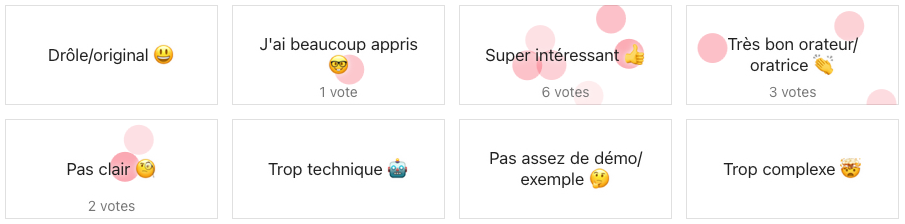
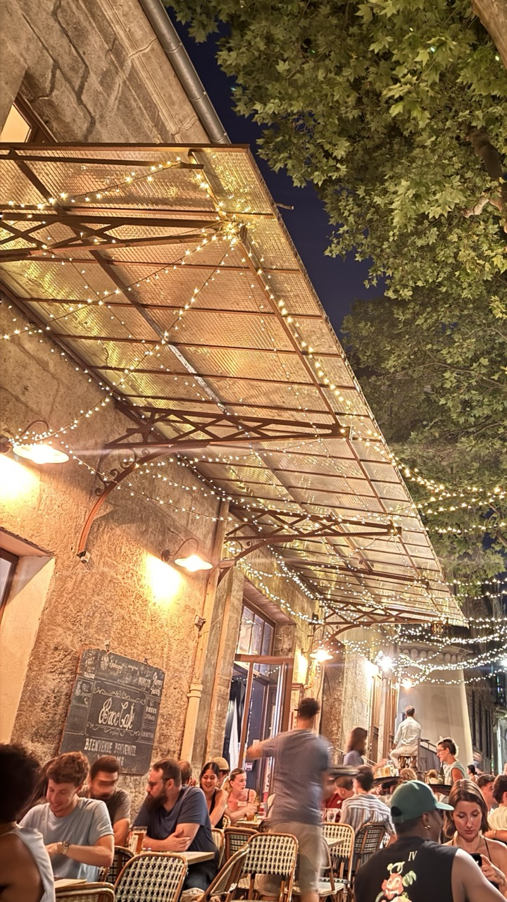
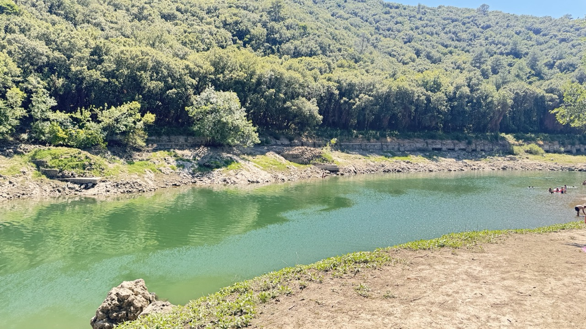

From my departure from Rouen to the post-event weekend, including feedback on 
the talks, follow me behind the scenes of a weekend in Montpellier for the
SunnyTech conference.

## What’s it like traveling to SunnyTech as a speaker?

Train scheduled on time on Wednesday, June 25th at Rouen station. I left home
around 11 a.m., with time to grab a coffee and something to eat on the way.

That’s when I met up with [Rudy](https://www.forkit.community/people/rudy-baer)
(who’s my co-speaker for this talk). Transfers in Paris were straightforward,
and we made our way smoothly to Montpellier, arriving a little after 6 p.m. It
was already quite a journey, under blazing sunshine and stifling heat\!

### Speaker Dinner

  

    As with many conferences, there’s the traditional speaker dinner the night
    before the event. It’s a chance for organizers and speakers to share a moment
    together before the madness of the next day. It’s also a way to thank the
    speakers for taking the time to prepare and deliver their talks.

    So we were greeted by the organizers at Esplanade de l’Europe after our train
    ride and boarded a shuttle to an unknown destination. While waiting, we met
    other speakers, some familiar faces 
    (like [Idriss](https://www.forkit.community/people/idriss-neumann)). The bus
    headed out to the speaker's dinner, and off we went to Palavas-les-Flots by the
    sea. We were welcomed with a punch, and the evening kicked off with networking
    in a cocktail-dinner format.

    This might be one of my only negative comments: as a vegetarian, there weren’t
    many options, and as often happens at cocktail-style dinners, everyone ends up
    picking from the veggie trays even though there are plenty of alternatives for
    other diets.
  

  

    
  

### First Day of the Conference

Maximum expected temperature on Thursday, June 26th in Montpellier: 33°C. Felt
like 50°C at 10 a.m. Okay, I’m from Normandy, so maybe I’m exaggerating a bit,
but it was already 30°C at 10 a.m. I started my day working a bit in the speaker
room, then sought some cooler spaces by attending a few talks.

#### Open Source Without Burnout? The CNCF Model

[Damien Matthieu’s talk](https://sunny-tech.io/sessions/cm6q7bkvx00g6ms3mj02rkocx/)
was very interesting, it introduced the Cloud Native Computing Foundation model.
Damien works at Elastic and is (almost) full-time on [OpenTelemetry](https://opentelemetry.io/),
which is led by the CNCF.

It was pretty cool to see how such a large open-source project is managed: the
processes and governance required when several proprietary actors take part in
the decision-making.

It was especially relevant for us to see this talk before ours, as we were able
to draw several parallels.

#### Metaprogramming in Rust

I’ve been interested in Rust for years, even if I don’t get to use it as much as
I’d like. So I found a good excuse to follow what’s happening in the ecosystem
by attending Didier Plaindoux’s talk and learning more about macros and what
goes on under the hood of the language.

The replay is [available on YouTube](https://www.youtube.com/watch?v=y0tl7vedgW0)
for anyone interested.

Attending this session was also a nice breather before the next one.

#### How to Embed Open Source Contribution into Your Company’s DNA

Alright, I didn’t attend this one because I was behind the mic with Rudy. In
this talk, we share our recipe for embedding open-source culture into a service
company.

What made presenting it together relevant was the dual perspective: Rudy as the
company head allocating time and budget, and me as an employee using those
resources.

And it seems the talk was well received by the audience in the amphitheater.

If you want to know our ingredients for embedding and sustaining open-source
culture in a service company, the [replay is available on YouTube](https://www.youtube.com/watch?v=uxoQfRDxN80).

#### End of Day

  

    The day ended in downtown Montpellier, in a small group, having a few drinks. A
    great opportunity to chat with people we met during the day and the talks we
    attended. A networking evening full of discussions on various tech topics.
  

  

    
  

### Second Day of the Conference

With our talk behind us, day two was more relaxed. Rudy had already headed home,
and I had no obligations, so I could attend whichever talks I wanted. Between
various meetups and discussions, I managed to see four talks.

#### Let’s Play Factorio

Such a cool concept: explaining computing concepts using Factorio. No slides
here, the entire talk is delivered through gameplay.

The great thing about this session is how visual and engaging it is. It covers
concepts like spaghetti code, layered (“lasagna”) code, and microservices
architecture. It even touches on networking topics like load-balancing. I highly
[recommend this one](https://www.youtube.com/watch?v=TnDRFGkeiwU), especially
for juniors, it’s a fun way to understand some core ideas.

#### Let’s Make Reactive Music with RxJS and the WebAudio API 🎧 🎼 🔊 🎛️

Such a shame the PC lagged, this one had a lot of promise\! If you’ve ever seen
how Tidal Cycles works (a tool for making music through code, if not, check out
strudel.cc), it’s a similar idea here. But this time, using the RxJS library and
some math magic.

#### Inbox Zero on Sentry: Mission Impossible?

I found this one insightful, especially since I use Sentry with a client. It was
valuable to see how the team justified spending time cleaning up errors to
decision-makers, and how they structured those two weeks with the dev team.

#### Behind the Scenes of JavaScript: What We Use Without Understanding 🎭

As a frontend developer using JavaScript daily, I was eager to see what this
session would offer. It was a good refresher on a few topics, definitely a
useful one\!

#### Build Your Own 8-bit Computer “from Scratch”

Olivier is a true enthusiast, he doesn’t like not understanding how things work.
That’s why he gave this talk. His goal? Build a computer from scratch to help
younger people understand how it all works. His only rule? No buying components
until he builds them himself.

So he started with transistors and gradually constructed an 8-bit computer.

#### Closing Keynote

The closing keynote was very topical. It explored embedded AI in projects and
the potential security vulnerabilities it introduces. Super interesting to learn
about both the positive and negative capabilities of LLMs integrated into our
code.

### End of the Week

Going to give a talk in the south of France was also a great excuse for me to
discover a part of the country I didn’t know. With a friend who also came down
from Rouen, we met up with a good friend who lives about 1.5 hours from
Montpellier. We had a meal together and then headed to the Bissaou dam, which
some locals had recommended for the intense heat (35°C).

We had a fantastic time and got to swim, a real relief after several scorching
days.

The next day, my friend from Rouen and I met up with members of the Fork it\!
community, [Alexandra](https://www.forkit.community/people/alexandra-pituru) and
[Luis](https://www.forkit.community/people/luis-rubiera). We enjoyed the
[Halles de Lez](https://www.hallesdulez.com/halles-du-lez), a great spot for
drinks and food. The food court has a wide variety of cuisines to try.

## The People You Meet

What I love about conferences is meeting people with all kinds of backgrounds.
That was definitely the case again at [SunnyTech](https://sunny-tech.io/).

I got to catch up with members of the Fork it\! community like
[Idriss Neumann](https://www.forkit.community/people/idriss-neumann),
[Olivier Huber](https://www.forkit.community/people/olivier-huber), and
[Luis Rubiera](https://www.forkit.community/people/luis-rubiera), as well as
SunnyTech organizers I’ve known for a while (a former classmate and a former
colleague).

In terms of unexpected encounters, I ran into a dev I used to play Overwatch
with a few years ago (before Overwatch 2 was out). He was a former colleague of
a former colleague. Good thing he recognized me, because I didn’t recognize him
at all\! That would’ve been a missed opportunity since it was really nice
catching up with him. This is exactly why I love conferences\!

Finally, I want to mention someone I met over drinks at the Thursday night
networking event, an inspiring profile thanks to a career change. Angélique went
from HR to boilermaker, and is now a C\#/.NET and Angular developer. She’s
gathered plenty of professional experience from other industries and has a clear
view of the pros and cons of ours.

I got to speak with many more people, but I didn’t want to just share a list of
meetings, I wanted to show what conferences can offer.

## In Summary

Speaking at conferences lets me both give and receive, a two-way exchange that
fully aligns with my philosophy of sharing knowledge. That’s especially true
when the conversations are based on real-life experiences (that’s also why I’m
part of the Fork it\! Community adventure).

Conferences are perfect for reconnecting with people (former colleagues,
community members) and for making enriching new connections that expand your
network and strengthen your relationships.
