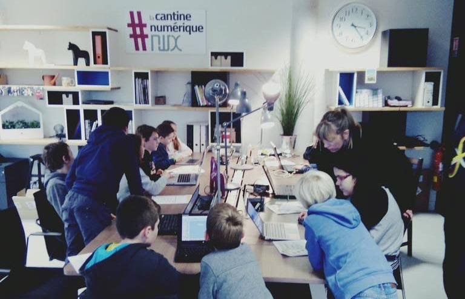
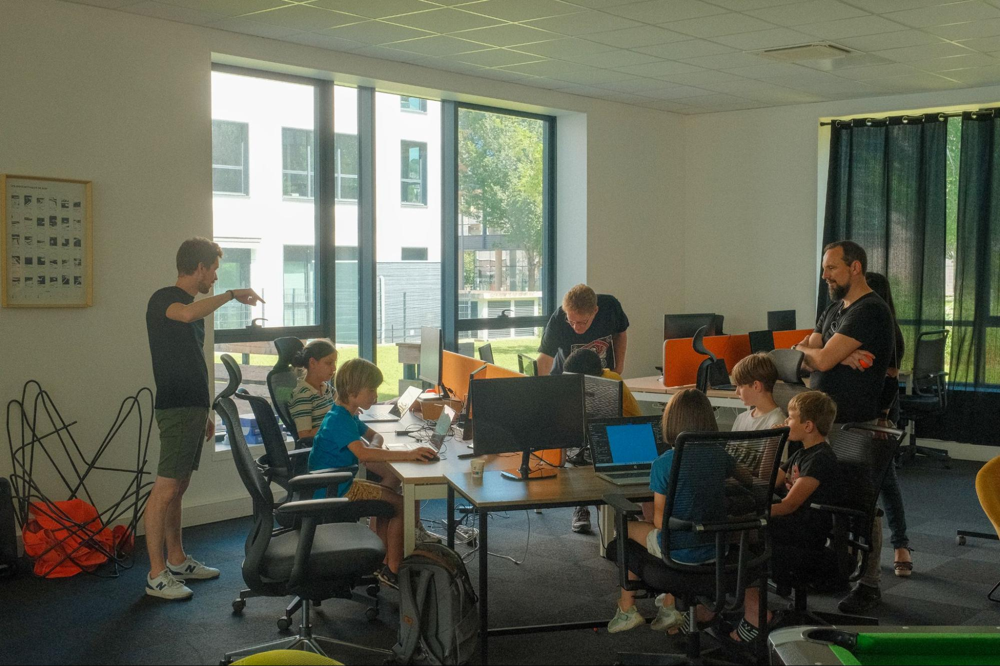

import { lunalink } from "@bearstudio/lunalink"
import { ROUTES } from "@/routes.gen"

When I was a teenager, I attended **Devoxx4Kids**. That day was a turning
point: it showed me that coding could be fun, creative, and collaborative. It’s
actually one of the reasons I decided to become a developer. So with Fork it\!
Community, I had this idea in the back of my mind: one day, I wanted to organize
something similar, to pass on that spark to other kids.

## Preparing the event

When we decided to launch Fork it\! for Kids in Rouen, I was both excited and
anxious. Excited, because it was something close to my heart. Anxious, because
working with kids is very different from preparing a talk for adults. I had to
think about how to simplify concepts, how to make activities engaging, and how
to adapt to very different age groups.

Preparation meant more than just choosing workshops. It also involved
coordinating with volunteers, securing the venue, and making sure we had the
right equipment for each activity. We built a program that could fit everyone:
Scratch and unplugged games for the youngest, robots and GDevelop for the middle
group, and Python or web basics for the older ones. My biggest worry was
simple: will the kids actually enjoy it? Or will they get bored halfway through?

## On the day itself

The answer came fast. As soon as the kids arrived, the atmosphere completely
changed. The room was buzzing with curiosity, laughter, and a bit of chaos (the
good kind). Some kids were shy at first, but you could literally see their
confidence grow as they solved challenges or made something work for the first
time.

For me, the day was a marathon. I didn’t get to sit still for a second: checking
that each room had the right setup, helping volunteers, answering parents’ questions,
fixing small technical issues. At times, it was stressful, there’s no “pause button”
when you’re dealing with a group of kids\! But each time I stopped for a moment
to watch a child proudly showing their game, their robot, or their very first
line of code, it felt very satisfying. That’s when all the stress faded away.

## What I learned

What struck me most while organizing Fork it\! for Kids was how different it is
to work with children compared to developers. I had to let go of jargon, explain
things in the simplest way possible, and constantly put myself in their shoes.

I also realized that not all kids learn the same way: some needed guidance step
by step, while others preferred to experiment on their own. That meant giving
space, not just instructions.

Another lesson was learning to trust the volunteers. Each of them brought their
own style to the workshops, and letting them adapt on the fly made the event run smoothly.

And finally, I discovered that managing parents is part of the equation too,
answering questions, reassuring them, keeping them involved. It was intense,
sometimes messy, but seeing the kids’ proud of what they created made it all
worth it.

## Looking ahead

This first edition was just the beginning. The enthusiasm from the kids, the
positive feedback from parents, and the motivation of the volunteers convinced
me that Fork it\! for Kids has real potential. I definitely want to organize
more, improve the format, add new challenges, and make the next editions even 
better.

Organizing Fork it\! for Kids was a challenge, but also a very rewarding 
experience. I’m glad I could share with kids the same kind of opportunity that 
inspired me years ago.

## Last words

I would like to thanks [Sonyth](/people/sonyth-huber) and [Olivier Huber](/people/olivier-huber), [Nhung Duong](/people/nhung-duong),
[Frédéric Bisson](/people/frederic-bisson), Noé Tatoud, Geoffroy Perrin,
[Matthieu Coulon](/people/matthieu-coulon), [Ivan Dalmet](/people/ivan-dalmet)
and Renan Decamps for their help and support for this event.

