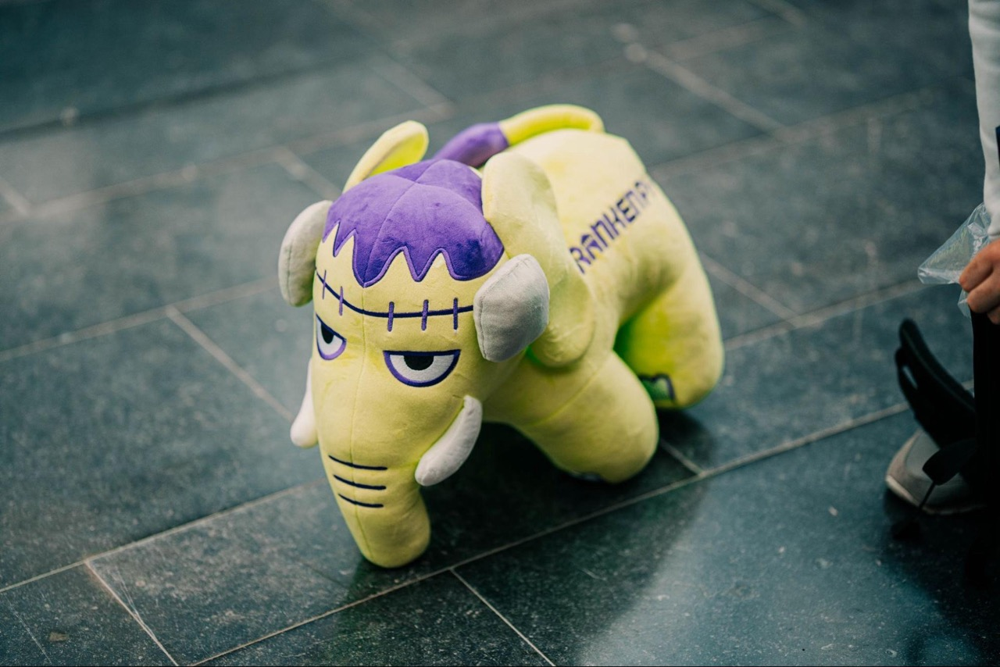
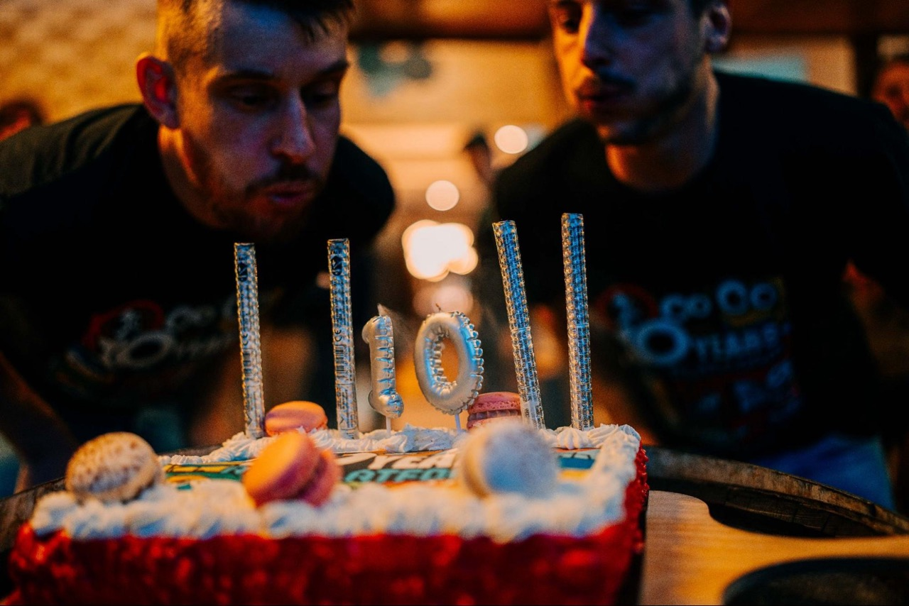
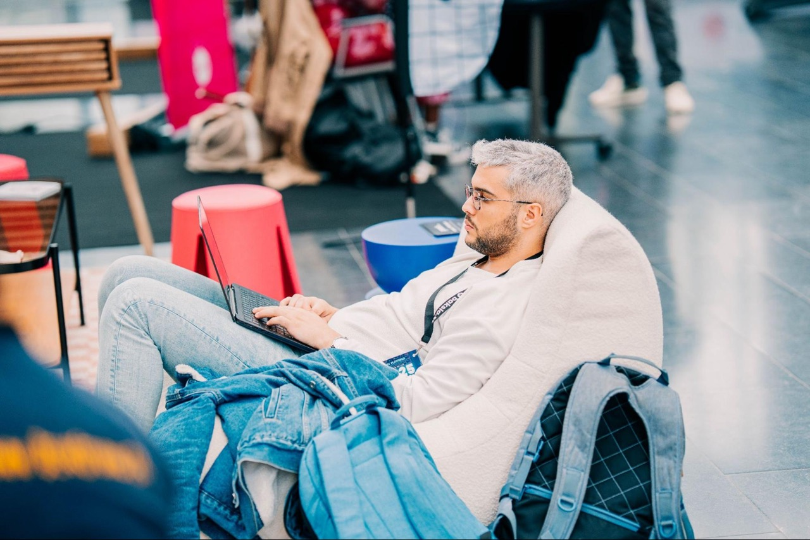

import PersonQuote from "@/components/PersonQuote/index.astro"

On September 18th and 19th, I had the opportunity to attend the **API Platform Conference** in
**Euratech, Lille**. This event celebrated the **10th anniversary of the API
Platform project**, bringing together the community that has grown around it
since its creation. Organized by [Les-Tilleuls.coop](https://les-tilleuls.coop),
the conference has become a central gathering point for about 400+ developers,
architects, and tech leaders who are building the future of APIs, supporting
more and more every year.

It was my second time attending this event, so I’ve met some people I already
knew, and some new faces. It was really great to meet the community again and
see so many people with the newly available FrankenPHP elephpants.

## The Atmosphere

To be honest, I had no real expectations before going to the conference, and I am
really happy to have gone there to learn more about API Platform and the PHP
ecosystem and meet awesome people. I really enjoyed my conversation with all
attendees, but I want to give a shoutout to [Yoan Bernabeu](https://www.linkedin.com/in/yoan-bernabeu/)
because we discussed a wide range of topics beyond just code. It was a pleasure
to finally meet them in person, as I've been following them on social media for a
while. I particularly enjoy their posts about their hiking adventures and their
science fiction book recommendations. We even talked about some great books,
including Kim Stanley Robinson's *The Ministry for the Future* and Becky
Chambers' *A Psalm for the Wild-Built*. We agreed that Chambers’ book was really
comforting for both of us.

## Talks and learnings

What’s great about the conference is that it is not all about **API Platform**,
but about its ecosystem. Talks are about **PHP**, **Symfony**, **Laravel**,
databases, servers, some frontend and even some society talks.
If you are looking for feedback on the conference, go check Baptiste Fotia’s
article on [their experience as an attendee at API Platform Conference 2025](https://www.linkedin.com/pulse/mon-retour-sur-lapi-platform-conference-2025-baptiste-fotia-llqof/).
They really did a great job at summarizing talks from speakers like Nils Adermann,
Laura Durieux, Imen Ezzine, Fabien Potencier, and more.

## Community Moments

The PHP ecosystem remains highly innovative, celebrating PHP's 30th anniversary
and API Platform's 10th. We enjoyed a community meeting on Thursday evening,
sponsored by JLRecrutement (a recruitment company who uses an Open Source job
board [available on GitHub](https://github.com/jlondiche/job-board-php)) with
some drinks and food at Les Sales Mômes in Lille. It was the occasion to blow
“10 years” candles to wish API Platform (and Webby 🕷️) an Happy Birthday.

As usual, after the conference, I was eager to experiment with API Platform upon
returning home.

## Takeaways

To end this quick review, I asked Rudy and Aziz to tell me one thing they remember the
most about the event:

<PersonQuote person="rudy-baer">I found the individuals there to be very engaging
in discussions, and the exchanges were genuinely constructive and serene.</PersonQuote>

<PersonQuote person="aziz-ouertani" class="flex-row-reverse">I loved the
community vibe, it feels very different and more special than others. Also the
sofa was conducive to napping, being very comfortable 😅.</PersonQuote>

Many thanks to Les-Tilleuls.coop for organizing such a great event, and to the
entire community for making it so special. It was a true pleasure to connect
with familiar faces and meet so many new people who share the same passion.

Finally, I'd like to extend my thanks and congratulations to [Nicolas Detrez](https://www.linkedin.com/in/nclsdtrz/)
for their outstanding photographic coverage of the event. All the images from
this article (except the "shocked face" one) are from them and all the photos of the event [are available on Flickr](https://www.flickr.com/photos/194052559@N02/albums/72177720329148577).

See you next year API Platform Conference 👋🏻
