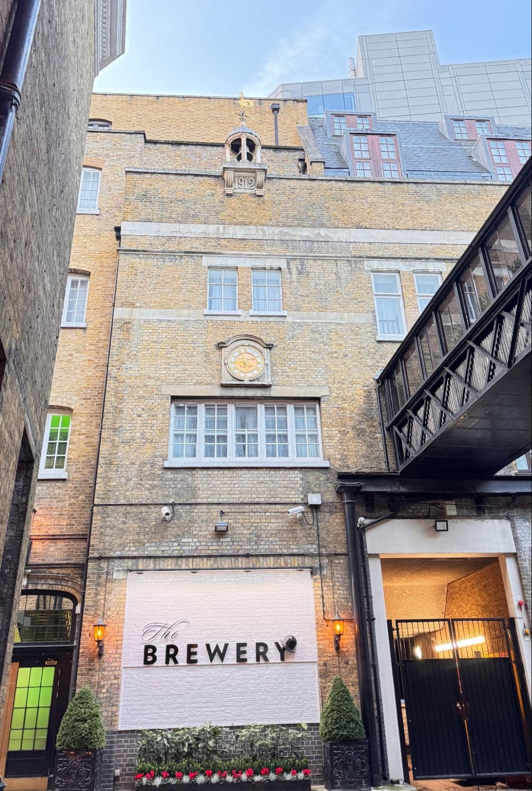
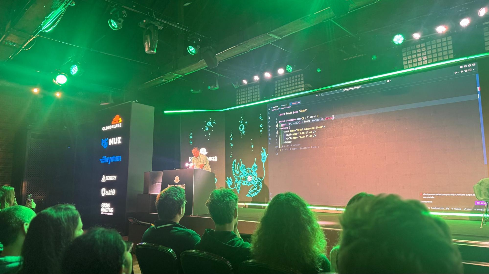
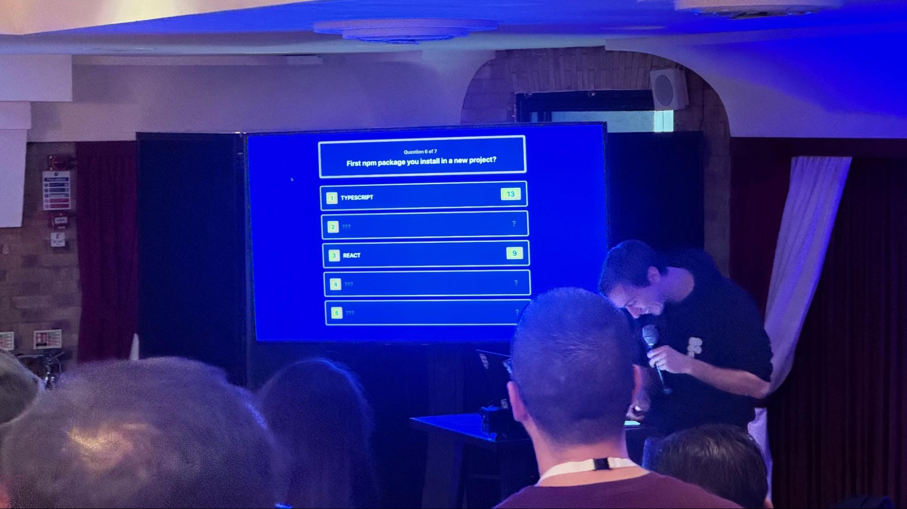

## Introduction

### A Chaotic Journey to London, courtesy of the French train system

My trip to [React Advanced](https://reactadvanced.com/) didn’t exactly start smoothly. First, the French train
system threw its usual chaos at me: a planned two-hour delay, followed by a full
cancellation. Thankfully, I had anticipated trouble and booked a backup FlixBus
leaving at 1:45PM and arriving at 3:15PM in Paris La Défense. Once in Paris, I
rushed to find the RER E and headed to Gare du Nord to catch the Eurostar to
London.

But the adventure wasn’t over. When I arrived at Gare du Nord, more issues
awaited, because of course they did. Fortunately, I met up with Emilie Follin,
the winner of the LinkedIn giveaway we ran, so at least we could struggle
through it together. A major electrical or IT outage had caused significant
delays: the train before ours was running 1 hour late, and ours ended up being
delayed by 40 minutes.

### What is React Advanced and who is it for?

React Advanced is a premier European conference for React and frontend engineers, focusing on deep technical topics like Server Components, modern architectures, performance, accessibility, and advanced tooling. It brings together experts and developers eager to push their understanding of React and explore what’s next in the ecosystem.

## Experience and Takeaways

### Warm Vibes and Great Reunions

  

    The venue, located in the financial district was visually perfect for this kind
    of conference, really beautiful and well suited for tech events. However, I have
    to admit I got a bit worried during the first morning break: the flow of people
    wasn’t optimized for such a crowd. It took me five full minutes just to get out
    of the room during a 20-minute pause.
  

  

      
  

The stage design was impressive, but unfortunately, the lower portion of the
slides was not visible to those seated beyond the front row. This significantly
detracted from the experience. And since the presentations were displayed on LED
screens instead of a projector, we basically got flashbanged every time a
speaker switched to a white slide.

From the moment I arrived, I genuinely felt welcomed, the organizers clearly put
a lot of thought into making attendees feel comfortable and taken care of. And
beyond the logistics, the human side of the event was just as warm. I was
especially happy to reconnect with familiar faces like [François Best](/people/francois-best) and [TkDodo](https://tkdodo.eu) (Dominick Dorfmeister); seeing them again instantly brought a
friendly, familiar energy to the day and reminded me how tight-knit the React
community can be.

### Talks that stood out to me

#### React Beyond the DOM

I always love to be reminded that React is not made only for the web. In his
talk, Erik Rasmussen has built a custom React renderer and reconciler and shared
his experience about it. It started with JSX to Markdown and finished with JSX
to IoT and light bulbs controlled using React.  
That was a great reminder that [React Native](https://reactnative.dev/),
[React PDF](https://react-pdf.org/), [Ink](https://github.com/vadimdemedes/ink)
and others are using low-level APIs to help us build projects today.

#### What's Under the Pointer?

Steve Ruiz's talk on [tldraw](https://www.tldraw.com/) was a highlight for me. I appreciate gaining insight into the development process, especially for applications I use. The performance and functionality of tldraw are excellent. It was fascinating to see the deliberate, ground-up design decisions and how a single minor adjustment could significantly impact the entire codebase.

#### Final Fantasy IX in React: Fighting the Browser, One Frame at a Time

I have to mention Joe Hart’s talk because it is a subtle mix of pure comedian and software engineering.   
What’s cool about this talk is to be reminded that engineers were limited at their time to develop video games, and that we still struggle today with the web platform.  
I always find it cool to see projects that re-implement old video games, because they let you discover lots of tricks about how developers managed things back in the day on very limited hardware.

### After party

#### Dinner courtesy of Ketryx

After the end of the last conference, we went to eat in a French brasserie chain, Côte, with some attendees, like [Noé](./noe-tatoud) and Emilie, and speakers like Aurora Scharff, François Best, Jan Peer Stöcklmair, Wyatt Johnson and Dominik Dorfmeister, invited by David Madner and Nataleigh O’Connell from [Ketryx](https://www.ketryx.com/).

#### Pub Quiz and Karaoke

The afterparty organized by React Advanced London was really great and provided a lot to the conference atmosphere. We started with a pub quiz. There were about 7 or 8 teams. Ours was made of French (François Best, Noé Tatoud and I) and Austrian (Dominik Dorfmeister and David Madner), so we called our team “FRAT” based on the domain from those countries. We did a bad job at the *Family Feud* part, but we had a huge score on the question: *Give the most input type attribute possible value.* We scored 17 out of 22 \!

### François' feedback

    
I also reached out to [François Best](/people/francois-best) for his perspective, and he kindly shared the following thoughts:

    

        
    

> If I had to pick 3 talks, those would be:
>  
> * The keynote by Erik Rasmussen on how to use React to render to anything (JSX to Markdown, IoT to pilot lights with physical sensors)  
> * Aurora Scharff’s live demo (amazing as always) on how to think about a11y with react-aria & performance with React 19. The keystroke indicator in the corner was particularly nice to show how the app reacted (or not) to keyboard events.  
> * Joe Hart’s closing talk on recreating Final Fantasy IX in the browser with React. Hilarious from start to finish, educational on reverse-engineering sprite sheets & 3D scenes stitching, and silly in the best possible way.
>
> My talk went well (20 minutes was short, I was speaking so fast!), the room was full, and the Q&A at the end was a very nice way to address feedback from the audience and community. I wanted to showcase an exciting new feature I’m working on for [nuqs](https://nuqs.dev/), but unfortunately it wasn’t ready on time (and wouldn’t have fitted the 20 minutes). Stay tuned for more info 👀
>  
> Overall, this was a very nice experience, and a great occasion to meet fellow OSS maintainers & friends from the web dev community.

## Conclusion

React Advanced London delivered on its promise of deep technical content and warm community connections. From custom React renderers controlling IoT devices to performance insights from tldraw, and even a hilarious recreation of Final Fantasy IX in the browser, the talks challenged our understanding of what's possible with React beyond traditional web applications.

What made this conference memorable wasn't just the technical depth, but the human side, reuniting with familiar faces, bonding over a pub quiz with the "FRAT" team, and sharing dinner with speakers and fellow attendees. These moments reminded me why conferences like React Advanced matter: they're not just about learning the latest patterns or Server Components, but about being part of a community that's passionate, curious, and constantly pushing boundaries.

If you're an experienced React engineer looking to challenge your understanding and connect with maintainers and fellow practitioners, React Advanced is an event worth considering.
