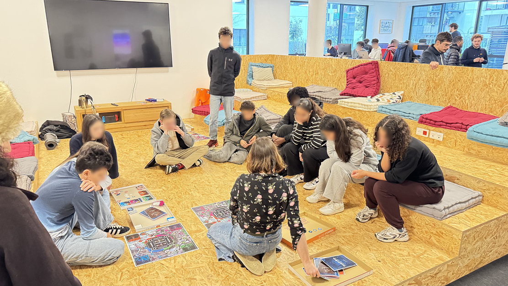
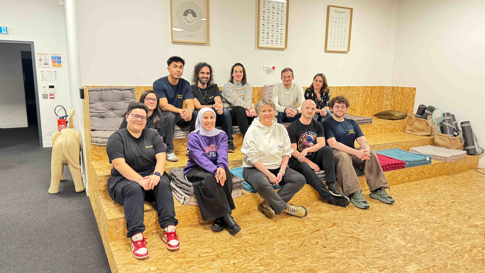
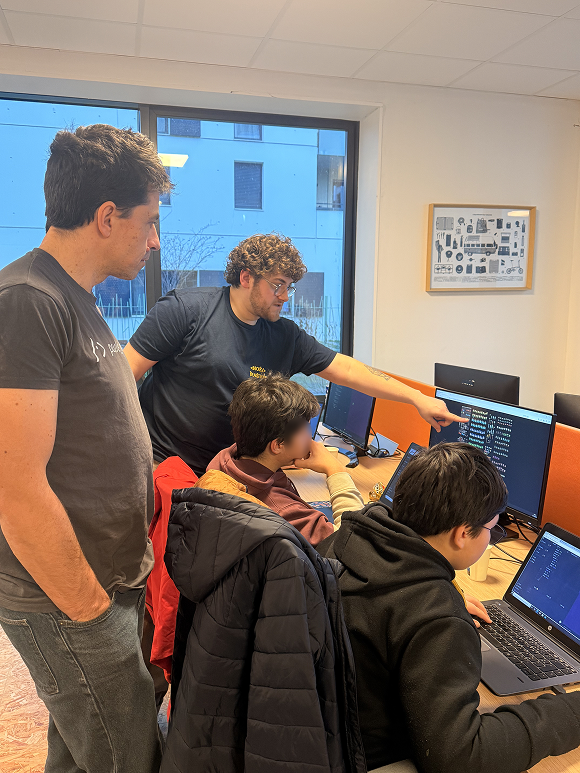

import PersonQuote from "@/components/PersonQuote/index.astro"

# Fork it\! For Kids \#2: Interview & Feedback from the organizers

After the first edition of Fork it\! For Kids, the project did not just continue, it evolved. This second edition was an opportunity to take a step back and reflect on how the idea grew through the children, the parents, and the volunteers.

For this second edition, Jeanne, lead organizer, shares her experience. She reflects on the spark that inspired the project, the challenges faced during this edition, and what motivated her to organize another edition. Through this interview, she also highlights the standout moments from the workshops.

The article also includes insights from Noé, who led a workshop in both editions, as he shares what motivated him to get more involved. Finally, it looks ahead to the future of Fork it\! For Kids and the ideas being considered for the next editions.

## What inspired you to create Fork It For Kids?

**Jeanne Grenet:**
What inspired me to create **Fork it\! For Kids** was a mix of personal experience and a strong desire to share. When I was a teenager, I attended a **Devoxx4Kids** workshop, and it was a real turning point for me. It showed me that programming could be fun, creative, and collaborative, and it later helped me find my way into web development.

Years later, I realized that many kids don’t have access to that kind of experience, or only encounter programming in a very theoretical way. I wanted to recreate that spark that stayed with me. A space where curiosity comes first, where making mistakes is part of learning, and where kids discover technology through games, creativity, and collaboration.

**Fork it\! For Kids** was born from that inspiration, a way to pass on what Devoxx4Kids gave me, by offering children a playful introduction to technology, supported by a community of passionate volunteers.

## Was there a moment or story from the workshops that really made you smile or surprised you?

**JG:**
Yes, there was a moment that really stayed with me. What surprised me the most was how deeply engaged the kids were during the workshops. At one point, even the snack break wasn’t enough to pull them away from what they were building. Some of them took a long time to come grab something to eat, and as soon as they did, they rushed back to their workshop to keep progressing.

Seeing kids so motivated that cake and candies became secondary was both surprising and incredibly rewarding. It was a clear sign that they were genuinely excited, focused, and proud of what they were creating.

## What were some of the challenges during this second edition compared to the first, and how did you tackle them?

**JG:**
One of the biggest challenges during this second edition was the number of children. We went from about 20 kids in the first edition to nearly 40 in the second one. That meant more workshops to run, more equipment to prepare, and more logistics to handle, especially when it came to materials and the snack break.

To tackle this, we adapted our organization. We had more volunteers involved, and we made sure to clearly divide the responsibilities between us. Thanks to that preparation and teamwork, everything went really smoothly despite the bigger scale.

I’d also like to take a moment to warmly thank all the animators and volunteers who made this edition possible. Their energy, dedication, and enthusiasm were essential to the success of the event. A huge thank you to [Noé Tatoud](/people/noe-tatoud), [Daryl Avila Bonnet](/people/daryl-avila-bonnet), [Vianney Charpentier](people/vianney-charpentier), [Baptiste Kervargant](/people/baptiste-kervargant), [Les Fées Marraines](https://www.lesfeesmarraines.fr/), Doralie Besnard, [Rudy Baer](people/rudy-baer), [Nhung Duong](/people/nhung-duong), [Yoann Fleury](people/yoann-Fleury) and the [Attineos](https://www.attineos.com) team for making this event happen.

## **What have you learned from organizing these workshops between the first and second editions?**

**JG:**
Between the first and second editions, I learned the importance of taking a step back and building on what already existed instead of starting from scratch. The first edition was very hands‑on and helped me understand what worked, while the second pushed me to be more structured, especially when it came to planning, timing, and logistics.

I also learned how essential it is to adapt the content to the audience. The first edition made me realize that children arrive with very different levels of knowledge and expectations. The second encouraged me to think more carefully about how to design activities that are accessible, engaging, and inclusive for everyone.

## **Looking ahead, what are your plans or hopes for the next editions?**

**JG:**
Looking ahead, my main priorities are to help the event grow in visibility and to keep organizing new editions regularly. Building that consistency is important to make Fork it\! for Kids a lasting initiative rather than a one‑off experience.

I also hope to reach more children, whether they already have some basics in computing or are complete beginners, as long as they’re curious to discover this world. Beyond introductory workshops, I’d love to organize additional events focused on specific topics, such as presenting the different careers in tech, to go further than just introducing kids to computing and give them a broader view of what the digital field has to offer.

## **fter leading a workshop in the first edition, what motivated you to lead a second one and become more involved in the organization?**

**Noé Tatoud:**
I have always been passionate about sharing knowledge in subjects I'm enthusiastic about. While the first edition was valuable, I felt limited in my ability to fully develop my own content (I did not prepare it myself), which motivated me to create a more personalized contribution for this second edition. My primary drive, however, remains witnessing the genuine excitement children display when discovering new concepts. Those moments when understanding dawns in their eyes or when they experience the satisfaction of successfully completing a challenge are what truly inspire me.

## **Conclusion : Looking back, moving forward** 

This second edition of **Fork it\! For Kids** marks an important step in the project’s development. It shows the progress made since the first edition, with a more structured organization, richer workshops, and stronger collaboration among the volunteers. The enthusiasm of the children remains at the heart of the initiative.

The feedback and challenges encountered have helped clarify the vision for Fork it\! For Kids. The workshops highlight the value of a space where curiosity is encouraged and mistakes are part of the learning process. Technology is explored through play, creativity, and teamwork.

This edition confirms the importance of these workshops. They are not only an introduction to computing, but also an experience that can build confidence, curiosity, and a lasting interest in the digital world.

*Spoiler alert :* A new edition of Fork it\! For Kids is planned for 2026\.

